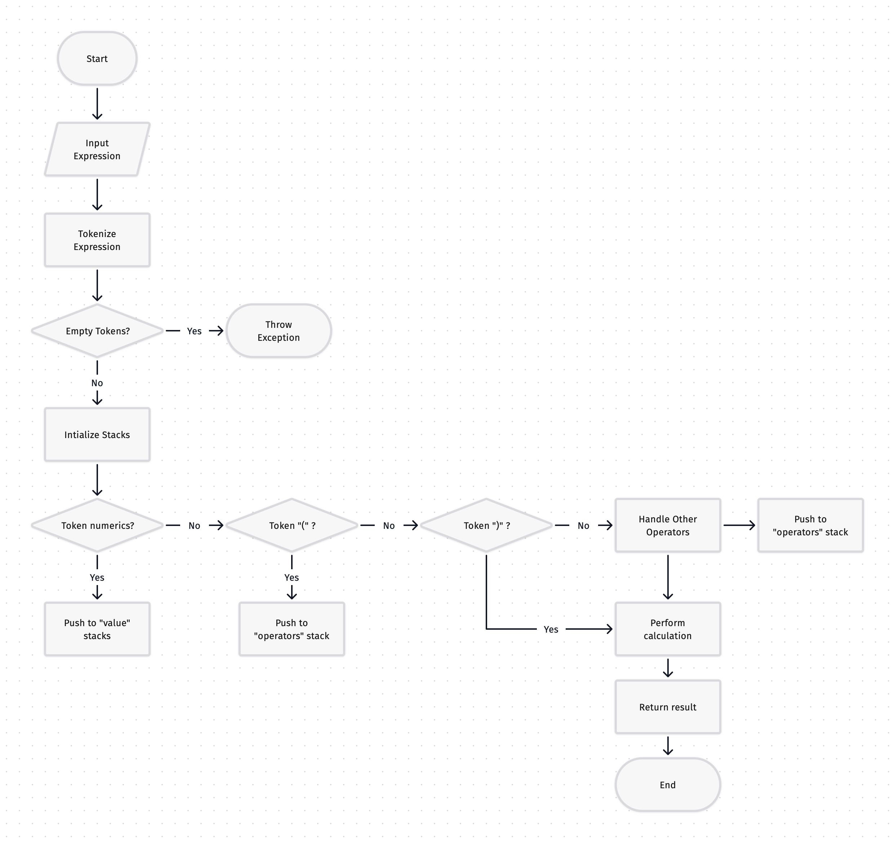
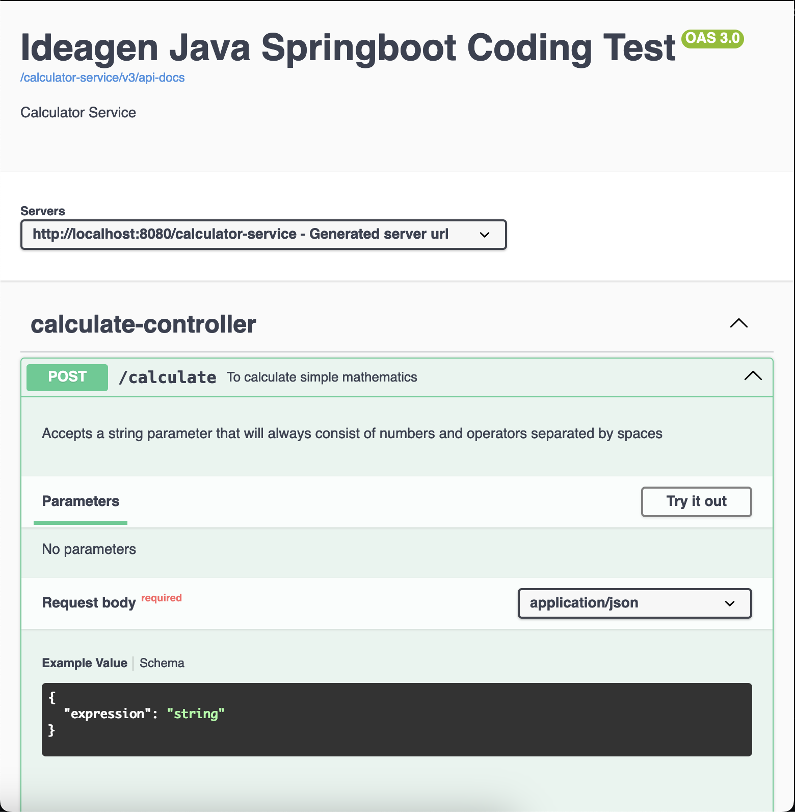
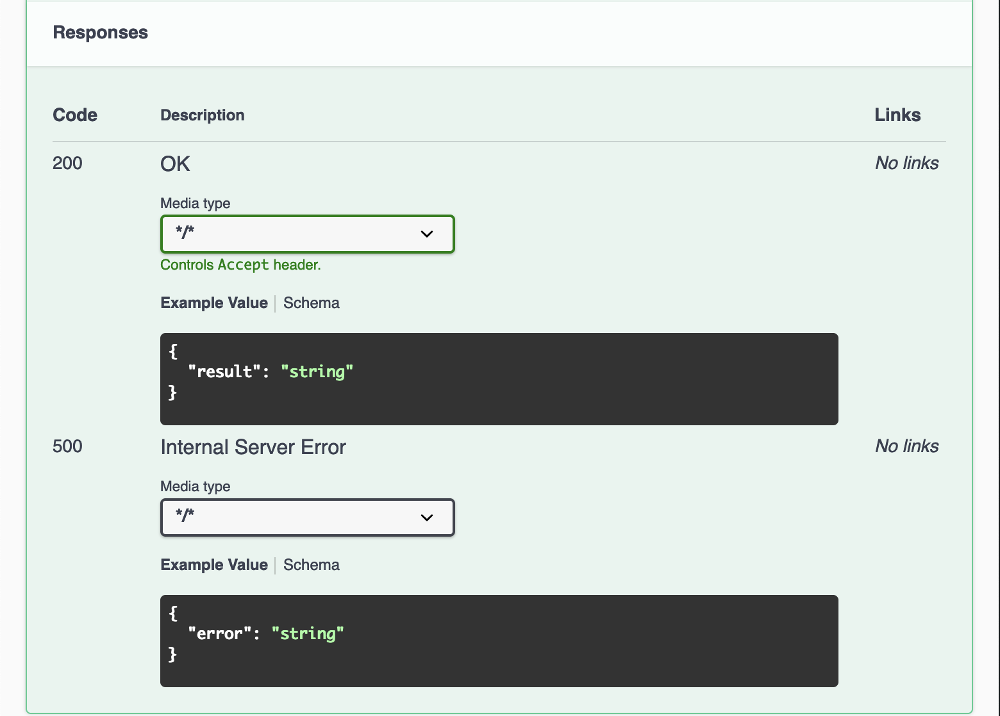

# Ideagen
Springboot Coding Test


## Summary 
This assessment was inspired by the article on expression evaluation from GeeksforGeeks, which can be found here https://www.geeksforgeeks.org/expression-evaluation/ <br><br>
I learned about the implementation of the ```applyOperation``` and ```hasPrecedence``` method, which performs the necessary arithmetic operations based on the given operators and operands. 

```java
public class ExpressionUtil {

    public static final Pattern DIGIT_OPERANDS = Pattern.compile("\\d+(\\.\\d+)?|[+\\-*/()]");

    public static final Pattern MATHS = Pattern.compile("^[0-9+(\\.\\d+)?\\-*/()\\s]+$");

    public static boolean hasPrecedence(String operation1, String operation2) {

        if (StringUtils.containsAny(operation2, "(", ")")) {
            return false;
        }

        if (StringUtils.containsAny(operation1, "*", "/")
                && StringUtils.containsAny(operation2, "+", "-")) {
            return false;
        }

        return true;
    }


    public static double applyOperation(String operation, double valueB, double valueA) throws ArithmeticException {

        BigDecimal a = BigDecimal.valueOf(valueA);
        BigDecimal b = BigDecimal.valueOf(valueB);

        BigDecimal result = switch (operation) {
            case "+" -> a.add(b);
            case "-" -> a.subtract(b);
            case "*" -> a.multiply(b);
            case "/" -> Optional.of(b)
                    .filter(val -> val.compareTo(BigDecimal.ZERO) > 0)
                    .map(a::divide)
                    .orElseThrow(()-> new ArithmeticException("Cannot divide by zero"));
            default -> throw new ArithmeticException("Invalid operations");
        };

        return result.doubleValue();
    }
}

```

Implementation 
```java
@Service
public class CalculateServiceImpl implements CalculateService {

    @Override
    public Double calculateByExpression(String expression) {

        // To filter first if its Math Operations: If not throw
        if (!ExpressionUtil.MATHS.matcher(expression).matches()) {
            throw new ArithmeticException("Invalid operations");
        }

        // Define the pattern to match numbers and operators
        List<String> tokens = ExpressionUtil.DIGIT_OPERANDS.matcher(expression)
                .results()
                .map(MatchResult::group)
                .toList();

        if (CollectionUtils.isEmpty(tokens)){
            throw new ArithmeticException("Tokens is not available");
        }

        // First time me learning stack data structure 🤣
        Stack<Double> values = new Stack<>();
        Stack<String> operators = new Stack<>();

        for (String token: tokens) {
            if (NumberUtils.isCreatable(token)) {
                values.push(Double.parseDouble(token));
            } else if (StringUtils.equals(token, "(")) {
                operators.push(token);
            } else if (StringUtils.equals(token, ")")) {
                performValuesOperation(()-> !StringUtils.equals(operators.peek(), "("),
                            values, operators);
                operators.pop();
            } else {
                performValuesOperation(()-> CollectionUtils.isNotEmpty(operators)
                                && ExpressionUtil.hasPrecedence(token, operators.peek()),
                        values, operators);
                operators.push(token);
            }
        }

        performValuesOperation(()-> CollectionUtils.isNotEmpty(operators),
                values, operators);

        return values.pop();
    }

    private void performValuesOperation(Supplier<Boolean> condition, Stack<Double> values, Stack<String> operators) {
        while (condition.get()) {
            if (CollectionUtils.size(values) < 2) {
                throw new ArithmeticException("Invalid Operations");
            }
            double value = ExpressionUtil.applyOperation(operators.pop(), values.pop(), values.pop());
            values.push(value);
        }
    }

```

### Hours Summary 
In total, I have spent of 11 hours for this exercise 😀

| Date     | Hours | Decsription                                                                                                                               |
|----------|-------|-------------------------------------------------------------------------------------------------------------------------------------------|
|28th June | 3     | Reading geeks for Geeks <br> Spring boot initialization, dependencies and installation                                                      |
|29th June | 7     | Implementations for solution. <br> Dedicate time to learn the stacks data structure, regex, functional programming, and switch expression | 
|30th June | 1     | Readme.MD documentation                                                                                                                   |

## Flowchart of calculator service 

The bellow diagram is the flowchart for evaluating mathematical expression that i learned during the implementation 



## API Request / Response 

### Open API

Following are the request/response documentation provided Open API 

<br> 



### [POST] http://localhost:8080/calculator-service/calculate
#### Success Sample  

##### Request 
```json
{
    "expression": "10 - ( 2 + 3 * ( 7 - 5 ) )"
}
```

##### Response 
```json
{
    "result": "2.0"
}
```
<br><br> 
#### Fail Sample
###### Request 
```json
{
    "expression": "6abcdef/3"
}
```

###### Response 
```json
{
    "error": "Invalid operations"
}
```


## Unit Testing

I have conducted unit testing under the ```Bonus``` section in the requirements.
The unit testing returns as ``` Passed ```


```java
@SpringBootTest
public class CalculateServiceTest {

    @Autowired
    private CalculateService calculateService;

    private static final List<Expression> expressions  = new ArrayList<>();

    static {
        expressions.add(new Expression("( 11.5 + 15.4 ) + 10.1", 37));
        expressions.add(new Expression("23 - ( 29.3 - 12.5 )", 6.2));
        expressions.add(new Expression("10 - ( 2 + 3 * ( 7 - 5 ) )", 2));
    }

    @Test
    public void calculateTest(){

        for (Expression exp : expressions) {
            double result = calculateService.calculateByExpression(exp.getExpression());
            Assertions.assertThat(result).isEqualTo(exp.getResult());
        }

    }
}
```
